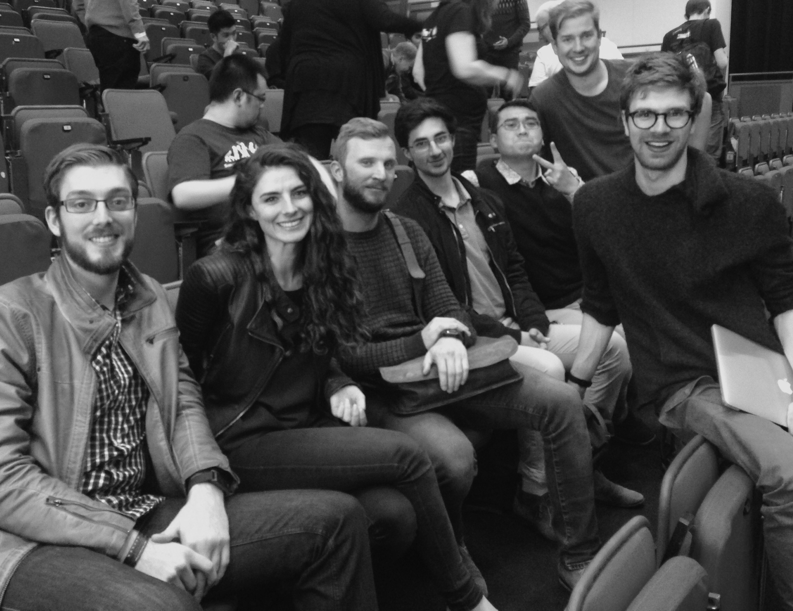

Description
===========
Code for the Sugihara project
- November 2016
- Swinburne University, Melbourne

Sugihara aims to crowdsource the verification of data from
public sources, in order to help first-responders during an
emergency.

People
======

From left to right: [Mike](https://au.linkedin.com/in/mike-jennings), [Fida](https://www.linkedin.com/in/tafida/), [Marko](https://github.com/MarkoDiUS), [Aryaman](https://www.linkedin.com/in/aryaman-pandav), [Mahathir](https://github.com/ma-al), Sasha, [Nick](https://au.linkedin.com/in/nick-williams-7a941168). *(Not in photo: [Kristin](https://au.linkedin.com/in/kristinmark), Anthony)*

Requirements
============
The code stands up a working site. There is one page showing the UI for:
- members of the public to **add evidence**
- volunteers that log in to **verify said evidence**

Technology
- [Meteor](https://www.meteor.com/)
- [Materialize](http://materializecss.com)

Thank you to Marko and [DiUS](http://dius.com.au), for the
awesome Amazon EC2 instance.
